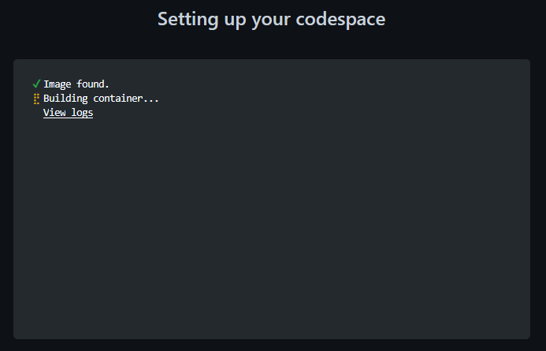

You can try out the system in [GitHub Codespaces](https://docs.github.com/en/codespaces/overview) or you can clone and build the repo on your local machine. Instructions for both of these alternatives follow.

## Alternative 1: Use GitHub CodeSpaces
In your web browser, navigate to the [repo on GitHub](https://github.com/MikeHopcroft/model-flow). Click the green button, labelled `<> Code` and then choose the `Codespaces` tab.
Then click the green `Create codespaces` button.

If this is your first time creating a codespace on this repo, 
GitHub will take a moment to create a dev container image for your session.

Once the image has been created, the browser will load a version
of VSCode, which has been configured to communicate with your dev container in the cloud.

Note that the dev container is pre-configured to clone the repo and run `npm run install` so you are ready to go as soon as VS Code appears in your browser.

Remember that you are running in the cloud, so all changes you make to the source tree must be committed and pushed before destroying the CodeSpace. GitHub accounts are usually configured to automatically delete CodeSpaces that have been inactive for 30 days.

For more information, see the [GitHub CodeSpaces Overview](https://docs.github.com/en/codespaces/overview)

## Alternative 2: Configure your Dev Machine
1. Install [Node.js (20.9.0 LTS or newer)](https://nodejs.org/en). Note that this version of node comes with `npm` package manager.
2. Clone the repo with `git clone https://github.com/MikeHopcroft/model-flow`.
3. `cd` to the root of the repo.
4. Install packages with `npm install`.

## Recommended Extensions

When you first open the repo in `Visual Studio Code`, it will recommend you install a number of extensions. These extensions help with linting and unit testing. Note that these extensions are pre-installed, when using the `CodeSpaces`.

## Building

To build the library and examples, run `npm run compile` from the root of the repo.

If you are using [Visual Studio Code](https://code.visualstudio.com/), you may find it useful to run the TypeScript compiler in watch mode so that the system automatically builds when edits are saved. Here's how:

1. In `Visual Studio Code` type `CTRL-SHIFT-B`. This will bring up the build task command palette.
2. Select `tsc: watch - tsconfig.json`

## Testing

`model-flow` uses the [mocha test framework](https://www.npmjs.com/package/mocha) with [chai assertions](https://www.npmjs.com/package/chai).

You can run tests in one of two ways:

1. From the command line, type `npm run test`.
2. From `Visual Studio Code` go to the Testing in the activity bar. Use the recommended [Mocha Test Explorer](https://marketplace.visualstudio.com/items?itemName=hbenl.vscode-mocha-test-adapter) extension.

## Linting

You can run the linter with `npm run lint`. In `Visual Studio Code`, the recommended [ESLint](https://marketplace.visualstudio.com/items?itemName=dbaeumer.vscode-eslint) and [Prettier](https://marketplace.visualstudio.com/items?itemName=esbenp.prettier-vscode) extensions assist in interactive linting.     